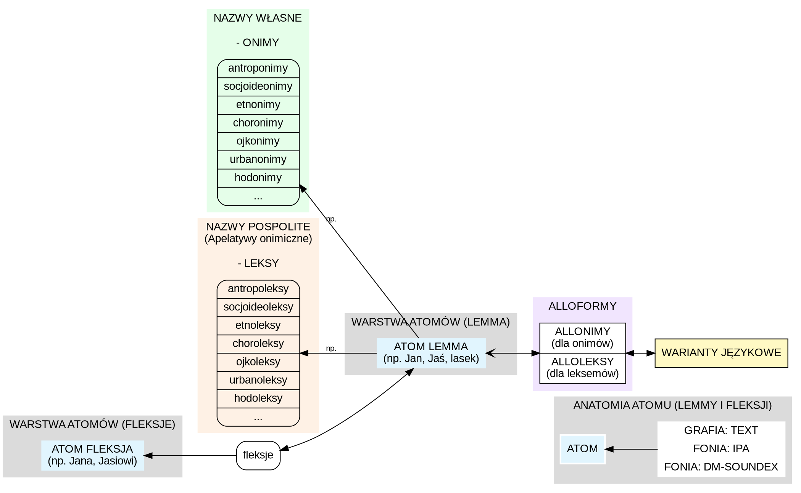
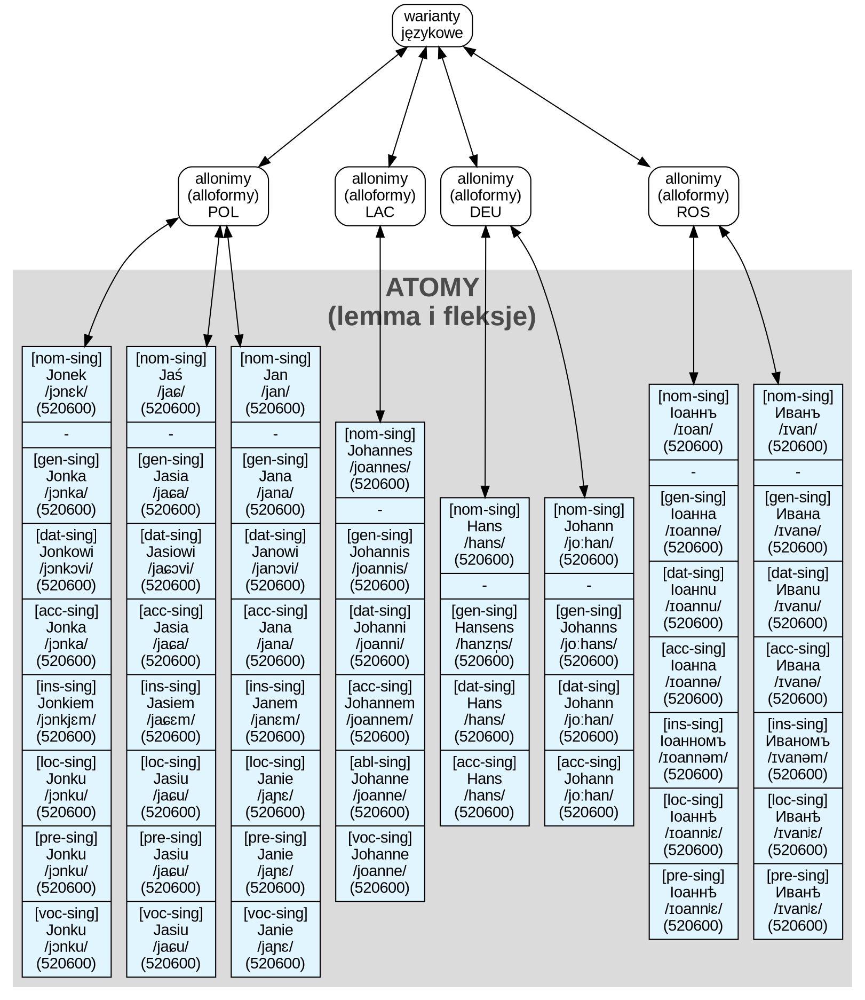

# [🎗️ ARBORETUM](https://github.com/j-Cis/arboretum#)

**🎗️ Arboretum** → zestaw narzędzi dla osób podchodzących w sposób badawczy/merytoryczny do sieci relacji międzyludzkich. Jeśli genealgia czy genealogia genetyczna są dla ciebie „_dobrą zabawą_” — wybacz raczej nie mieścisz się w puli adresatów projektu.

**🎗️ Arboretum** → 

---

## ✳️**A:**  _Stack_

| Dev | Target |
| :--- | :--- |
| Windows 11 (x64) / i7 | Windows (Modern/Legacy), Linux, macOS, iOS, Android |

1. [](https://www.rust-lang.org/)
[](https://slint.dev/)
[](https://www.egui.rs/)
[](https://github.com/blitzarx1/egui_graphs)
[](https://crates.io/crates/egui-graph-edit)
[](https://crates.io/crates/polars)
[-b358a5.svg?logo=surrealdb&logoColor=white)](https://surrealdb.com/)
[](https://tokio.rs/)
[](https://crates.io/crates/tracing)

2. [](https://crates.io/crates/thiserror)
[](https://crates.io/crates/anyhow)
[](https://crates.io/crates/console-subscriber)
[](https://crates.io/crates/color-eyre)
[](https://crates.io/crates/dashmap)
[](https://crates.io/crates/fslock)
[](https://crates.io/crates/named-lock)
[](https://crates.io/crates/notify)
[](https://crates.io/crates/directories)
[](https://stebalien.com/projects/tempfile-rs/)
[](https://crates.io/crates/fs2)
[](https://crates.io/crates/rfd)
[](https://crates.io/crates/clap)
[](https://crates.io/crates/inquire)
[](https://crates.io/crates/colored)
[](https://crates.io/crates/bincode)
[](https://crates.io/crates/ciborium)
[](https://serde.rs/)
[](https://crates.io/crates/uuid)
[](https://crates.io/crates/petgraph)
[](https://crates.io/crates/rayon)
[](https://crates.io/crates/nom)
[](https://crates.io/crates/winnow)
[](https://crates.io/crates/jiff)
[](https://crates.io/crates/chrono)
[](https://crates.io/crates/validator)

3. ?  [](https://crates.io/crates/strsim)
[](https://crates.io/crates/tantivy)
[](https://crates.io/crates/tarpc)
[](https://crates.io/crates/interprocess)
[](https://crates.io/crates/self_update)
[](https://crates.io/crates/plotters)
[](https://crates.io/crates/layout-rs)
[](https://crates.io/crates/graphviz-rust)
[](https://crates.io/crates/resvg)
[](https://crates.io/crates/dot-structures)
[](https://crates.io/crates/fdg-sim)

---

## ✳️**B:**  _Zasady jakości kodu_

W kodzie staram się stosować sprawdzone zasady projektowe i inżynierskie, których celem jest czytelność, prostota, niezawodność:

* **DRY (Don't Repeat Yourself)** – eliminacja powielania logiki; reużywalność; pisanie z myślą o ponownym użyciu.

* **DDD (Domain-Driven Design)** – Projektowanie zorientowane na domenę; skupianie się na modelu problemu, a nie na technologii.

* **SRP (Single Responsibility Principle)** – każda struktura, moduł i funkcja ma jedną, jasno określoną odpowiedzialność.

* **OCP (Open/Closed Principle)** – kod otwarty na rozszerzenia, ale zamknięty na modyfikacje.

* **LSP (Liskov Substitution Principle)** - Podtypy muszą być wymienialne z typami bazowymi bez łamania kontraktu.

* **ISP (Interface Segregation Principle)** - Interfejsy powinny być małe i wyspecjalizowane.

* **DIP (Dependency Inversion Principle)** - Moduły wysokiego poziomu nie powinny zależeć od modułów niskiego poziomu.

* **SoC (Separation of Concerns)** – wyraźny podział odpowiedzialności pomiędzy warstwy i moduły.

* **LoD (Law of Demeter) & Minimal Dependencies** – minimalizacja zależności między modułami i strukturami; ograniczanie zewnętrznych zależności dla stabilności projektu.

* **SSoT (Single Source of Truth)** – unikanie definiowania tego samego stanu lub logiki w wielu miejscach.

* _niekiedy →_ **IoC (Inversion of Control) & DI (Dependency Injection)** - Odwrócenie sterowania, wstrzykiwanie zależności.

* _niekiedy →_ **KISS (Keep It Simple, Stupid)** – prostota ponad nadmierną abstrakcję.

* **Modular Design** – małe, niezależne moduły łatwiejsze w utrzymaniu i testowaniu.

* **Composition over Inheritance** – preferowanie kompozycji zamiast dziedziczenia.

* **Encapsulation / Information Hiding** –  ukrywanie szczegółów implementacji i eksponowanie tylko niezbędnego API.

* **Immutability by Default** –  zmienne są niemutowalne, dopiero gdy naprawdę potrzebujesz, użyj `mut`.

* **Idiomatic Rust** – czytelne, jednoznaczne i zgodne z konwencją nazwy funkcji, struktur, modułów oraz folderów.

* **Zero-cost Abstractions** – korzystanie z idiomatycznych abstrakcji bez wpływu na wydajność.

* **Fail Fast & Fail Early & Defensive Programming** – szybkie wykrywanie i raportowanie błędów.

* **Error Handling with Result / Option** – jawne i idiomatyczne zarządzanie błędami.

* **The Boy Scout Rule** – pozostawianie kodu w lepszym stanie, niż go zastało.

## ✳️**C:**  _Powód projektu_

💠 _**Po co kolejny program? - przecież jest ich tak wiele!** - otóż nie! Spośród dostępnych na rynku programów - a długo szukałem / czkeałem, ponad 10 lat - nie istnieje żaden w pełni odpowiadający moim oczekiwaniom. Stąd też głównym adresatem niniejszego rozwiązania, jestem ja sam._

💠 _**Istniejące programy, mają ogromny problem z wydajnością.** Dla przykładu pół miliona osób w `GRAMPS` (napisany w `Python`) daje bazę `sqlite.db` o rozmiarze `3.66 GB` czas otwierania, i manipulacji na danych jest niebotycznie duży. **🎗️ Arboretum ma być szybsze, nie tylko przez szybszą technologię użytą, ale także przez zmianę metodyki działań.**_

💠 .

## ✳️**D:**  _Koncepcje_

### 💭**D1-a:**  _BAZA SYSTEMOWA: PODSTAWOWYCH WYRAZÓW_




Przkładowa pozycja




Cel jest prosty, chcę zgromadzić w osobnej bazie sytemowej, imiona, nazwiska, zawody, miejscowości itp

* podczas indeksacji metryki lub innego kilkusetnego źródła, będzie można wpisać fragment słowa, lub parę liter, a sytsem podpowie możliwe, słowa

* uniknięcie głupich błedów z pomyłką pisowni, użytkownik będzię wprowadzał dane podstawowe, metodą przekopiowania słowa do bazy osobistej (o ile jeszcze w niej nie istnieje); elementy z bazy systemowej w badzie osobistej, będą przechowywane pojedynczo (bez duplikatów) natopiast w każdym miejscu gdzie dana nazwa miała by być użyta będzie do niej referencja, dięki temu nie będziemy mnożyć niewiadomo ile powtóżeń Jana, zmniejszając rozmiar. Dodatkowe znalezienie wszystkich osób będzie natychmiastowe, bez potrzeby wyszukiwania za każdym razem.

### 💭**D1-b:**  _BAZA SYSTEMOWA: LOKALIZACJI_

Ta baza będzie w pewien sposób rozszerzeniem bazy **podstawowych wyrazów**   będzie podzielone na obszary świata, które będzie można osobno sobie pobrać, dowiemy się z niej **GDZIE** znajdują się ojkonimy i choronimy na mapie.

### 💭**D1-c:**  _BAZA SYSTEMOWA: PRZYNALEŻNOŚCI_

Ta baza będzie w pewien sposób rozszerzeniem bazy **podstawowych wyrazów**   będzie podzielone na obszary świata, które będzie można osobno sobie pobrać, dowiemy się z niej **KIEDY** dany ojkonimy należałdo danego choronimu.

Obecnie podobną funkcjonalność oferuje [GOV GENEALOGY.NET](https://gov.genealogy.net/item/show/KOPINOJO84WS)

---

### 💭**D2-a:**  _OGÓLNE KONCEPCJE BAZODANOWE_

_Brak kosztownych operacji `JOIN` znanych z `SQL`, model bazy jest grafowy! Z Hipergrafami osiągniętymi przez reifikacje Krawędzi - czyli uznanie że Hiperkrawędź też jest Węzłem. (W SurrealDB jest to banalnie proste i wydajne, bo Surreal pozwala przechowywać tablice linków (Array of Record IDs) bezpośrednio w rekordzie.) Bazy będą maksymalnie zatomizowane a zarazem uporządkowane bardziej niż w modelu GRAMPS._

>```plaintext
> ├──┬ 📂 clog/
> │  └── 📄 00000000000000000000.clog
> └──┬ 📂 manifest/
>    └── 📄 00000000000000000000.manifest
>```
>
>Nie mamy tu jak w SQLite plików z rozszerzeniem `*.db`

_Architektura oparta na współdzielonym stanie konfiguracyjnym. Wydajna dzięki plikom konfiguracyjnym w formacie CBOR (Concise Binary Object Representation) lub Bincode (bardzo szybki, specyficzny dla Rusta), zamiast parsowania tekstu (TOML/XML/JSON) w czasie rzeczywistym między procesami. Traktuje plik konfiguracyjny jako "token" przekazywania stanu. Atomowy zapis pliku konfiguracyjnego (tempfile + std::fs::rename) - eliminujący błędy związane z np utratą zasilania..; Singleton na poziomie aplikacji (fslock / named-lock)._

---

## ✳️**E:**  _modele wprowadzania informacji u innych_

### 🏗️**E1:**  _MyHeritage_

Jestem zadowolonym posiadaczem abonamentu `PremiumPlus` wraz z `abonamentem kompletnym` korzystam z MyHeritage od 2008 roku, i powstanie tego programu `Arboretum` nie wpłynie na zaprzestanie! będzie on służył do gromadzenia i zarządzania i porządkowania, natomiast MyHeritage pozostanie do publikacji i poszukiwań osób zajmujących się tymi samymi danymi `SmartMatch`.

Skupmy się teraz na sposobie wprowadzania danych, mamy tu tylko rekordy typu osoba, i wszystko drzemie w nich, gdy szukamy to możemy szukać tylko w obrębie tego co jest wpisane w oknie `imiona` i `nazwisko` to determinuje dodawania róznych niepotrzebnych infromaci w tych oknach tylko poto aby móc po tym `tagu` coś znaleźć. I tak dla przykładu:

* w imieniu mojego taty mam `✅ ✉️ ⧭ Jerzy Maciej Stanisław Józef, ⛿[PL-12: Tarnów]` a w nazwisku mam `h.Sas, Cisowski (z Niemirowa), ♂I‐Y250574 ♀T1a1b‐a`, i tak w mojej konwencji pozwala mi to wyszukać inne osoby pasujące do tagów, nie tylko innych Jerzych i innych Cisowskich ale (tu gdzyby to była kobieta mielibyśmy jeszcze `nazwisko panieńskie` zapomocą kótego również moglibyśmy szukać):
  * `✅` symbol oznacza że ta osoba z inną osobą ma potwierdzone dopasowanie genetyczne
  * `✉️` symbol oznacza że mam kontakt z taką osobą
  * `⧭` symbol oznacza że jest to mój przodek
  * `Jerzy Maciej Stanisław Józef` to standardowe imiona, można szukać pojedynczo lub zbiorczo
  * `⛿[PL-12: Tarnów]` ten ciąg pozwala wyszukać mi osoby pochodzące z małopolski `⛿[PL-12:` a lbo strikte związane z Tarnowem `⛿[PL-12: Tarnów]`
  * `h.Sas` to pozwala mi znaleźć osoby z herbem Sas
  * `Cisowski` to standardowe nazwisko, można i po nim szukać ale trzeba pamiętać że `Cisowska` dla systemu to inne nazwisko
  * `(z Niemirowa)` to pozwala mi znaleźć rody z protoplastą w Niemirowie
  * `♂I‐Y250574` to pozwala znaleźć mi osoby z tą y-chromosomalną haplogrupą
  * `♀T1a1b‐a` to pozwala znaleźć mi osoby z tą mitochondrialną haplogrupą
* kolejne okienka w formularzu to `Tytuł`, `Przydomek` cokolwiek tu wpiszemy, nie będziemy mogli po tym szukać
* potem jest data urodzenia i śmierci obie z miejscem, oraz przyczyna śmierci i miejsce pogrzebu, a następnie małżeństwa z datami i miejscami - to też są izolowane dane których nie da się wyszukać.

Po wybraniu opcji `Edytuj więcej szczegółów` mamy wiecej opcji, których też nie da się wyszukać:

* SEKCJA `Info podstawowe`: możemy tu dodać `Imie Religijne`, `Poprzednie imię`, `Przezwisko`, `Nazwa po (imiennik)` - gdzie wskazujemy inną pojedynczą istniejącą w bazie osobę.
* SEKCJA `Rodzina` możemy tu dodać informacje czy to jest `biologiczne` dziecko czy inny rodzaj a także `świadków` z ślubów w formie krókiego tekstu.
* SEKCJA `Biografia` możemy tu napisać coś i dołączyć obrazki, ale uwaga nie mamy mozliwości przeczytać tego z poziomu aplikacji mobilnej, to biografie są nazwane `przypis` i możemy ich utówrzyć dużo koło siebie.
* SEKCJA `Informacje kontaktowe` tu nie będę się rozwodził, mammy rubryki: adresów, mailów, telefonów, i profilów w sieci.
* SEKCJA `Praca` i SEKCJA `Edukacja`: tu możemy dodać prace i edukacje, wypełniając dla każdego elementu rubryczki `Zatrudnienie/Edukacja`, `Miejsce`, `Przypis` i `Od` `Do` (daty).
* SEKCJA `Ulubione` tu możemy rodzielając przecinkami podać: `Zainteresowania`, `Aktywności`, `Muzyka`, `Filmy`, `Programy Telewizyjne`, `Książki`, `Sporty`, `Restauracje`, `Kuchnie świata`, `Ludzie i gwiazdy`, `Krótkie wakacje`, `Cytaty` - nie będę komentował tej sekcji - jest absurdalna.
* SEKCJA `Informacje osobiste` tu mamy: `Religia`, `Narodowość`, `Język`, `Polglądy polityczne`, `Wzrost`, `Waga`, `Kolor włosów`, `Kolor oczu`, `Sprawność fizyczna`
* SEKCJA `Źródło cytatu` to jedna z tych sekcji nad któą najbardziej ubolewam, możemy tu wszakże podać źródła, ale zarządzanie nimi jest w zasadzie żadne!możemy dodać podobnie jak w `Biografi`, `Edukacji`, `Pracy` wiele `odnośników do źródeł / Cytatów / Źródeł cytatu` (różnie nazywanych  - tyczących się tego samego elementu); w każdym jednym wskazujemy `źródło` lub tworzymy nowe (opiszę poniżej), następnie mamy `Tekst cytatu` w którym możemy napisać dłużą informacje tak jak w `Biografi`, możemy podać `Srtona/URL`, `Potwierdzenie` (stopień ufności), oraz `data`
  * podsekcją jest opcja dodawania źródła w której mamy takie róbryczki: `Tytuł źródła`, `Skrót`, `Autor`, `Wydawca`, `Agencja`, `Opis`, `dołączanie: zdjęć, plików, i dokumentów źródła`
* SEKCJA `Wszystkie fakty` mamy tu wylistowane nasze fakty wcześniejsze takie jak `Narodziny`, `ślub`, `adresy`, `prace`, `edukacje` dodatkowo są też `liczba znanych dzieci` i możemy tu dodać dowolny inny fakt, niektóre fakty posiadają spersonalizowane róbryczki względem nich, ale ogólnie do każdego faktu (poza wyjątkami) możemy dodać: `data`, `miejsce`, `krótki opis`, `przypis` (w formie takiej jak w biografi, możemy dodać ich wiele), `Cytaty` (w takiej formie jak w sekcji `cytaty`, tez możemy dodać ich wiele), oraz ostatni element `zdjęcia` możemy tez dodać ich wiele.
Dodatkowo z poziomu wyświetlenia profilu osoby jak i z poziomu zdjęć, możemy przypisać do osoby wiele zdjęć, na których możemy zaznaczyć ramkę z twarzą.
Każde pojedyncze zdjęcie może mieć podstawowo `nazwę`, `date` i `miejsce` dodatkowo jak już wspomniałem, pozaznaczane ramki twarzy przypisane do osób, można też dodać `słowa kluczowe` i `uwagi`, a także przypisać do albumów (co jest starsznie czasochłonne).
W profilu osoby mamy też opcje związane z DNA autosomalnym, i Podobieństwami automatycznymi.

Oczywiście MyHeritage posiada funkcję przeszukiwania, ale nie możemy w niej zaznaczyć że interesują nas tylko nasze drzewa, szukamy po całym dwu miliardowym zbiorze `https://www.myheritage.pl/research/category-5000/family-trees` tu możemy szukać po `imieniu`, `nazwisku`, `dacie urodzenia i miejscu`, `dacie śmierci i miejscu`, `dacie małżeństwa i miejscu` a także po po innych wydażeniach: `miejscu zamieszkania (data i miejsce)`,`służba wojskowa (data i miejsce)`,`imigracja (data i miejsce)`,`lub dowolne wydarzenie bez nazwy (data i miejsce)`, dodatkowo możemy uszczegółowić i podać: `Ojciec (imie i nazwisko)`, `Matka (imie i nazwisko)`, `Dziecko (imie i nazwisko)`, `Małżonek (imie i nazwisko)`, `Brat/Siostra (imie i nazwisko)`, możemy też dodać `słowo kluczowe` które działa dziwnie, oraz `płeć`.

### 🏗️**E2:**  _FamilySearch_

Z FamilySerach rónież korzystam od niezliczonych czasów conajmniej od 2014 a może i wcześnie, jest on dużo bardziej czasochłonny, ale ma wiele żeczy lepiej przemyślanych niż MyHeritage, a innych poprostu nie ma lub działają gorzej. Podstawową wadą tego serwisu, jest to że każdy może edytować wszystko i bardzo często czas jaki poświęcimy idzie do kosza, bo ktoś coś zmieni w sposób niezgodny z rzeczywistością.

* W sekcji `kluczowe informacje` mamy : `imię i nazwisko`, `płeć`, `Narodziny`, `Chrzest`, `Śmierć`, `Pochówek` każda z tych informacji posiada niezależne wskazanie daty ostatniej edycji oraz informacje kto tej edycji dokonał (co jest bardz przydatne! w sekcji `Ostatnie zmiany` możemy przejżeć historię wszystkich zmian, od początku od stworzenia profilu, co również jest cenne!). I tak dla każdego mamy widzimy listę źródeł które to potwierdzają (samo dodawanie źródła jest w innym miejscu), oczywiście wyświetla nam się informacja jeśli zmieniamy istniejący profil, kto i kiedy dokonał zmiany, i możemy wyświetlić wszystkie poprzednie zmiany, a także możemy podać uzasadnie:
  * `imię i nazwisko` : tu możemy podać `język`, `tytuł`, `imiona`, `nazwisko`, `sufiks`
  * `płeć` to wiadomo 3 opcje `mężczyzna`, `kobieta`, `nieznana`
  * `Narodziny`, `Chrzest`, `Śmierć` `Pochówek`: w każdym podajemy `datę` i `miejsce`
* W sekcji `Członkowie rodziny` edytujemy relacje z rodzicami, z małżonkami i dziećmi, co kluczowe możemy wygodnie dodać wielu rodziców, nap adopcyjnych czy przybranych itp.
  * KOICJA: W podsekcji małżeństwo (zarówno własne jak i małżeństwo rodziców), możemy do każdej z dwojga osób wchodzących w koicję podać uzasadnienie, mamy też datę dodania każdej z dwóch osób i informację kto to dodał,
    * do każdego małżeństwa^(czyli komórki rodziny/koicji) możemy dodać wydarzenia 5 typów `Małżeństwo`, `Mieszkali razem`, `Rozwód`, `Małżeństwo według prawa zwyczajowego`, `Unieważnienie` - każde z nich ma następujące pola `Data`, `Miejsce` i `Uzasadnienie` a także jak w sekcji `kluczowe informacje` widzimy listę źródeł które to potwierdzają (samo dodawanie źródła jest w innym miejscu), a takze mamy info kto i kiedy edytował, oraz możlowość podglądnięcia wszystkich zmian.
    * cudowną rzeczą któej MyHeritage nie posiada, to możemy dodać przez kolejną podsekcję `Fakty` niestety tu również jest ograniczenie i jedynym faktem jaki możemy dodać to `Brak dzieci` z uzasadnieniem i tak samo jak wszedzie źródłami i historią zman.
    * kolejna podsekcja to `Notatki` tu możemy dodać swobodny tekst do 10000 znaków, z tytułem w osobnym polu,
    * i ostatnia podsekcja to `Źródła` tu mamy 3 opcje `Dodaj nowe źródło`, `Dodaj nowe źródło wspomnienia`, `Dołącz ze Schowka ze źródłami` to opiszę w sekcji źródeł by nie powielać.
    * a takze możemy zobaczyć historię wszystkich zmian.
  * FILIACJA: Druga podsekcja to edytowanie/dodawanie szczegółów na temat relacji dziecka z rodzicami, i to dotyczy zarówno relacji z rodzicami (wstępni) jak i relacji z dzieckiem (zstępni); i tu przy każdym z rodziców możemy podać relacje i jej uzasadnienie, z relacji mamy wybór: `Biologiczna`, `Aopcyjna`, `Zastępczy`, `Kuratela`, `Przybrana`, natomiast przy dziecku, podobnie jak w KOICJI, mamy datę dodania/ostatniej zmiany i info kto dodał, a także pole `uzasadnienia`. Tu tak samo mozemy dodać `Źródła`, `Notatki` i zobaczyć historię wszystkich zmian.
* kolejna sekcja to `Inne relacje` ona również jest kluczowa i brakuje jej w MyHeritage, ale jest ograniczona tylko do kilku relacji: `Domostwo`, `Krewny`,`Nauka zawodu`, `Niewola`, `Praca`, `Rodzic chrzestny`, `Sąsiad`, każda taka relacja w podsekcji ma podony zestaw informacji do uzupełnienia jak w podsekcji KOICJA czyli: przy każdej z dwojga osób mamy ostatnią zmianę i przez kogo; a także uzasadnie; możemy dodać specyficzne wydarzenia z tytułem `opis relacji` a następnie tak samo jak w poprzednich sekcjach (data,miejsce, uzasadnienie, historia zmian, lista śródeł potwierdzającyh); a także możemy dodać notatki, źródła, i zobaczyć historię zmian jak wszędzie.
* kolejna sekcja to `Inne informacje`
  * `Alternatywne imie i nazwisko` mamy tu do wyboru takie typy jak `Znany też jako`, `Imie i nazwisko przy urodzeniu`, `Imie i nazwisko po zawarciu małżeństwa`, `Przydomek` - a cały formularz jest identyczny jak w podsekcji `imię i nazwisko` w sekcji `kluczowe informacje`
  * `Wydarzenia` mamy tu do wyboru takie typy jak : `Przynależność`, `Bar micwa`, `Bat micwa`, `Kremacja`, `Imigracja`, `Służba wojskowa`, `Naturalizacja`, `Tytuł szlachecki`, `Zawód`, `Przynależność religijna`, `Miejsce zamieszkania`, `Martwo urodzone`, i najważniejsza pozycja `Wvdarzenie zdefiniowane` - czyli dowolne. W wiekszości wydażeń podajmy `Opis`, `Datę`, `Miejsce`, `Uzasadnienie` (to jak i każde inne w innym miejscu, może mieć 2000 znaków), a w wydarzeniu dowolnym dodatkowo `tytuł wydarzenia` dodatkowo jak wszędzie mamy listę źródeł, informacjie kto i kiedy zmienił, oraz możność zobaczenia wszystkich zmian.
  * `Fakty` mamy tu do wyboru takie typy jak: `Nazwa kasty`, `Nazwa klanu`, `Dokument tożsamości`, `Pochodzenie narodowe`, `Brak relacji pary`, `Brak dzieci`, `Opis fizyczny`, `Rasa`, `Plemię`, i najważniejsza pozycja  `Zdefiniowany fakt` - czyli dowolny. W wiekszości faktów podajmy `Opis` i `Uzasadnienie` , a w fakcie dowolnym dodatkowo `tytuł faktu` dodatkowo jak wszędzie mamy listę źródeł, informacjie kto i kiedy zmienił, oraz możność zobaczenia wszystkich zmian.
* kolejna sekcja to `Krótka historia życia` możemy tu opisać w notatce maks 10000 znaków krótką historię, dodatkowo mamy też pole uzasadnienia, a także możność zobaczenia histori zmian.
* kolejna sekcja to `Notatka` możemy tu opisać w notatce maks 10000 znaków cokolwiek, dodatkowo mamy też pole uzasadnienia, każdej notatce nadajemy też tytuł, a także możność zobaczenia histori zmian, oraz kto edytował i kiedy.
* kolejna sekcja to `Ostatnie zmiany` pozwala nam prześledzić wszystkie zmiany w obrębie profilu.

Na osobnej karcie mamy zarządzanie materiałami źródłowymi oraz Wspomnieniami (czyli miedzy innymi fotografiami). Na pojedynczej fotografii, możemy oznaczyć osoby, dodać plik audio z opowieścią o zdjeciu, mamy inforamcje kto zamieścił i kiedy, możemy dodać etykiety tematów na zdjęciu, dodać do albumy, opisać historię dotyczącą zdjęcia (dołączone zdjęcia(max 10), Tytuł histori, treść, miejsce, data); Album może zawierać tytuł i opic do 4000 znaków;

Natomiast na karcie źródła, `w dodawaniu nowego` podajemy datę, tytuł, rodzaj `url strony internetowej` albo `wspomnienie`, następnie mamy treść cytatu, uwagi, uzasadnienie, i etykiety czego to dotyczy: Imie i nazwisko, Płeć, Narodziny, Chrzest, Śmierć, Pochówek.; DOdatkowo mamy przechowywalnie źródeł `https://www.familysearch.org/pl/tree/sources/sourceBox` z której możemy istniejące źródło, dołaczyć do profilu. w każdym źródle mamy też uzasadnienie i historie edycji.

### 🏗️**E3:**  _Gramps_

.svg)

#### **E3:**-1. EDYTOR NOTATEK

* **Pola:** prywatność (tak/nie), identyfikator, rodzaj notatki [text], notatka [text] preformatowany.
* **Powiązania:** tagi /etykietki (**∞**), notatki (**∞**), rodzina (**∞**), zdarzenia (**∞**), lokalizacje (**∞**), repozytoria (**∞**), linki (**∞**), cytaty (**∞**), źródła (**∞**), media (**∞**), osoba (**∞**).

#### **E3:**-2. EDYTOR ŹRÓDEŁ: CYTATY

* **Pola:** prywatność [tak/nie], tom/strona [text], zaufanie [poziom], data/okres/przedział, kolejność atrybutów, kolejność obiektów/foto, kolejność notatek.
* **Powiązania:** źródło (**1**), atrybuty / cechy (**∞**), odwołanie do obiekt. (**∞**), tagi / etykietki (**∞**), linki do notatek (**∞**).

#### **E3:**-3. EDYTOR ŹRÓDEŁ: ŹRÓDŁA WŁAŚCIWE

* **Pola:** identyfikator, zaufanie [poziom], tytuł [text], autor [text], info o publikacji [text], streszczenie/opis [text], kolejność repozytoriów.
* **Powiązania:** atrybuty / cechy (**∞**), tagi / etykietki (**∞**), repozytoria (**∞**).

#### **E3:**-4. EDYTOR ŹRÓDEŁ: ZAGNIEŻDŻANIA W REPOZYTORIACH

* **Pola:** prywatność (tak/nie), rodzaj obiektu [text], identyfikator źródła w repozytorium [text], kolejność notatek.
* **Powiązania:** repozytorium (**1**), linki do notatek (**∞**).

#### **E3:**-5. EDYTOR ŹRÓDEŁ: REPOZYTORIA

* **Pola:** prywatność (tak/nie), nazwa [text], identyfikator, kolejność adresów, kolejność internetowych linków, kolejność notatek.
* **Powiązania:** tagi / etykietki (**∞**), adresy repozytorium (**∞**), linki internetowe (**∞**), linki do notatek (**∞**).

#### **E3:**-6. EDYTOR ZDARZEŃ

* **Pola:** prywatność (tak/nie), rodzaj zdarzenia [text], krótki opis [text], identyfikator, data/okres/przedział, kolejność atrybutów, kolejność obiektów/foto, kolejność cytatów, kolejność notatek.
* **Powiązania:** lokalizacja (**1**), atrybuty / cechy (**∞**), odwołanie do obiektów (**∞**), tagi / etykietki (**∞**), linki cytatów źródłowych (**∞**), linki do notatek (**∞**).

#### **E3:**-7. EDYTOR MIEJSC

* **Pola:** prywatność (tak/nie), rodzaj miejsca [text], współrzędne geograficzne, kod pocztowy, identyfikator, kolejność nazw, kolejność internetowych l., kolejność notatek, kolejność cytatów, kolejność zawierających, kolejność obiektów/foto.
* **Powiązania:** nazwa preferowana (**1**), nazwy alternatywne (**∞**), tagi /etykietki (**∞**), linki internetowe (**∞**), linki do notatek (**∞**), linki cytatów źródłowych (**∞**), zawiera się w .. (**∞**), odwołanie do obiektów (**∞**).

#### **E3:**-8. EDYTOR ZDARZEŃ: (ODWOŁANIA DO)

* **Pola:** charakter udziału osoby/rodziny w zdarzeniu [text], prywatność (tak/nie), kolejność atrybutów, kolejność cytatów, kolejność notatek.
* **Powiązania:** atrybuty / cechy (**∞**), zdarzenie (**1**), linki cytatów źródłowych (**∞**), linki do notatek (**∞**).

#### **E3:**-9. EDYTOR RODZINY

* **Pola:** prywatność (tak/nie), kolejność dzieci, identyfikator, kolejność cytatów, kolejność notatek, kolejność zdarzeń, kolejność atrybutów, kolejność obiektów/foto.
* **Powiązania:** ojciec / mąż / partner (**1**), matka / żona / partnerka (**1**), relacja rodziców i dziecka (**∞**), linki cytatów źródłowych (**∞**), linki do notatek (**∞**), odwołanie do zdarzeń (**∞**), atrybuty / cechy (**∞**), tagi / etykietki (**∞**), odwołanie do obiektów (**∞**).

#### **E3:**-10. EDYTOR RODZINY: RELACJA RODZICÓW Z DZIECKIEM

* **Pola:** relacja z ojcem [text], relacja z matką [text], prywatność (tak/nie), kolejność cytatów, kolejność notatek.
* **Powiązania:** dziecko (**1**), linki cytatów źródłowych (**∞**), linki do notatek (**∞**).

#### **E3:**-11. EDYTOR OSOBY

* **Pola:** prywatność (tak/nie), płeć (♂/♀/⚥), identyfikator, kolejność nazw, kolejność notatek, kolejność obiektów/foto, kolejność adresów, kolejność internetowych l., kolejność atrybutów, kolejność zdarzeń.
* **Powiązania:** nazwa preferowana (**1**), nazwy alternatywne (**∞**), linki do notatek (**∞**), (obiekt) portret osoby (**1**), odwołanie do obiektów (**∞**), tagi /etykietki (**∞**), adresy osoby (**∞**), linki internetowe (**∞**), atrybuty / cechy (**∞**), odwołanie do zdarzeń (**∞**).

#### **E3:**-12. EDYTOR OSOBY: NAZEWNICTWO

* **Pola:** prywatność (tak/nie), rodzaj nazwy [text], imiona [text], imię używane [text], tytuł [text], przyrostek [text], przezwisko [text], przezwisko rodowe [text], grupuj jako [text], sortuj jako, wyświetl jako, kolejność członów nazwy, data/okres/przedział.
* **Powiązania:** człony nazwy (**∞**).

#### **E3:**-13. EDYTOR OSOBY: CZŁON NAZWY

* **Pola:** człon podstawowy (tak/nie), prefiks członu [text], człon [text], sufiks członu i łącznik z następnym członem [text], kategoria członu nazwy np. pochodzenie [text].
* **Powiązania:** (brak pól referencyjnych z liczbami na czarnym tle).

#### **E3:**-14. EDYTOR OSOBY: ZALEŻNOŚCI MIĘDZY OSOBAMI

* **Pola:** prywatność (tak/nie), nazwa zależności [text], kolejność cytatów, kolejność notatek.
* **Powiązania:** wybrana osoba (**1**), linki cytatów źródłowych (**∞**), linki do notatek (**∞**).

#### **E3:**-15. EDYTOR ATRYBUTÓW / CECH

* **Pola:** nazwa atrybutu [text], zawartość atrybutu [text], prywatność (tak/nie), kolejność cytatów, kolejność notatek.
* **Powiązania:** linki cytatów źródłowych (**∞**), linki do notatek (**∞**).

#### **E3:**-16. EDYTOR ETYKIET / TAGÓW

* **Pola:** nazwa tagu, kolor tagu.
* **Powiązania:** (brak pól referencyjnych wychodzących).

#### **E3:**-17. EDYTOR FOTO / OBIEKTÓW / MEDIÓW: (ODWOŁANIA DO)

* **Pola:** prywatność (tak/nie), zaznaczony obszar na zdjęciu narożniki [ramka], kolejność cytatów, kolejność notatek, kolejność atrybutów.
* **Powiązania:** obiekt / zdjęcie (**1**), linki cytatów źródłowych (**∞**), linki do notatek (**∞**), atrybuty / cechy (**∞**).

#### **E3:**-18. EDYTOR ADRESÓW: (FIZYCZNYCH)

* **Pola:** ulica [text], miasto [text], kod pocztowy, powiat/woj., kraj [text], prywatność (tak/nie), telefon [text], data/okres/przedział, kolejność notatek, kolejność cytatów.
* **Powiązania:** linki do notatek (**∞**), l. cytatów źródłowych (**∞**).

#### **E3:**-19. EDYTOR MIEJSC: (ZAWIERAJACYCH SIĘ)

* **Pola:** data/okres/przedział.
* **Powiązania:** miejsce (**1**).

#### **E3:**-20. EDYTOR MIEJSC: NAZWY MIEJSCA

* **Pola:** nazwa miejsca [text], język [ISO 639-1:2002], data/okres/przedział.
* **Powiązania:** (brak pól referencyjnych wychodzących).

#### **E3:**-21. EDYTOR MIEJSC: ALTERNATYWNE ADRESY

* **Pola:** ulica [text], kod, miasto [text], telefon [text], parafia [text], powiat [text], wojew. [text], kraj.
* **Powiązania:** (brak pól referencyjnych wychodzących).

#### **E3:**-22. EDYTOR ADRESÓW: (INTERNETOWYCH)

* **Pola:** prywatny (tak/nie), rodzaj linku [text], opis linku [text], link [text].
* **Powiązania:** (brak pól referencyjnych wychodzących).

#### **E3:**-23. EDYTOR FOTO / OBIEKTÓW / MEDIÓW

* **Pola:** prywatność (tak/nie), identyfikator, tytuł [text], ścieżka [text], data/okres/przedział, kolejność cytatów, kolejność notatek.
* **Powiązania:** tagi / etykietki (**∞**), l. cytatów źródłowych (**∞**), linki do notatek (**∞**).

---
